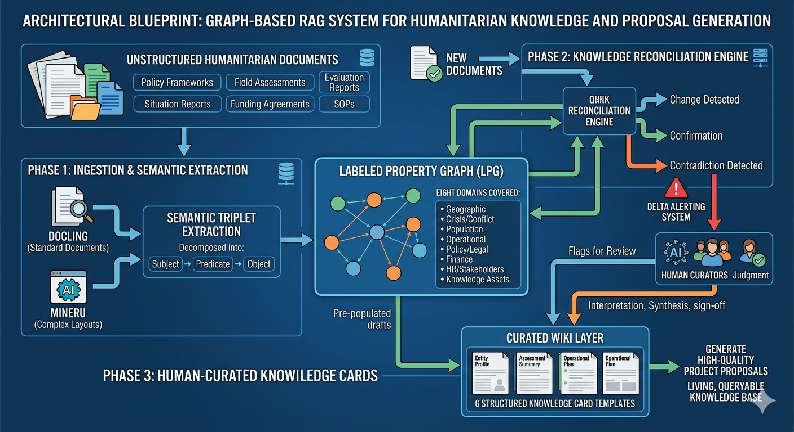

# Humanitarian Knowledge Pipeline

A document-to-knowledge intelligence system for UN and international humanitarian organisations.

---

## What This Is

Humanitarian organisations produce and consume enormous volumes of documents — policy frameworks, field assessments, evaluation reports, situation reports, funding agreements, SOPs. This knowledge exists, but it is buried, siloed, and inaccessible at the moment it is most needed: when a proposal deadline is approaching, when a new staff member needs to understand a context, when a programme team needs to know what the evidence says about a specific intervention.

This project defines the architecture of a system that changes that. It transforms a passive document library into a living, queryable knowledge base — and connects that knowledge base directly to the generation of high-quality project proposals.

---

## How It Works

The pipeline has three stages.

**Ingestion & Extraction.** Documents are parsed into structured knowledge using Docling (standard documents) and MinerU (complex layouts). Each document is decomposed into semantic triplets — Subject → Predicate → Object — and stored in a Labeled Property Graph. The graph covers eight domains: geographic and administrative context, crisis and conflict dynamics, population and demographics, operational programming, policy and legal frameworks, finance and funding, human resources and stakeholders, and knowledge assets.

**Knowledge Reconciliation.** As new documents arrive, the graph detects what has changed, what confirms existing knowledge, and what contradicts it. Contradictions are surfaced explicitly rather than silently overwritten. A delta alerting system notifies human curators when new data affects existing knowledge assets.

**Human-Curated Knowledge Cards.** The primary output of the system is a wiki showing key knowledge entitities and organised through six structured Knowledge Cards Templates — the single curated layer between the graph and any downstream use. The graph assists curation by pre-populating drafts; human judgment provides interpretation, synthesis, and sign-off.

---

## The Resulting Knowledge Cards

Six card types templates, each scoped to a specific intelligence and agentic interaction needs:

| Card | Answers |
|---|---|
| **KC-1 Donor Intelligence** | For each donor: Who is this funder, how do they think, what does the current instrument require |
| **KC-2 Field Context** | For each field context: What is the situation, who is affected, what are the needs and risks |
| **KC-3 Outcome Evidence** | For each outcome: What interventions work, at what cost, measured how, implemented how |
| **KC-4 Partner Capacity** | For each partner: Can this partner deliver, at this scale, with acceptable risk |
| **KC-5 Institutional Track Record** | For each operation: Why UNHCR — credibility, past performance, relationship capital |
| **KC-6 Crisis Political Economy** | For each crisis: Why this crisis, why now, what is the strategic framing |

Each card carries a validity period. Expired cards revert to draft automatically. Proposals cannot be generated against an expired or unapproved card.

---

## Building for Agentic system

For instance, when a proposal needs to be drafted, an agentic system assembles the relevant cards, scores candidate interventions against the field context, constructs a cost-justified budget from historical expenditure data, and generates a structured draft. Every claim in the output is traceable to a specific source node in the graph.

Cards are read in a defined order: field context first to establish the situation, outcome evidence to select and justify interventions, partner and track record to ground the implementation case, and the donor card last — because the donor card sets the tone, language, and framing for the entire document.

---

## Design Principles

**Human judgment is not optional.** The system assists curators — it drafts, alerts, and flags. It does not replace the judgment required to interpret a political context, assess a partner relationship, or decide whether evidence from one setting transfers to another.

**Every claim is traceable.** No figure enters a proposal without a source node. The graph stores provenance for every piece of knowledge: the document it came from, the date it was extracted, the curator who approved it.

**Expiry is a feature.** Knowledge cards have validity periods. A six-month-old field context card is not the same as a current one. The system makes staleness explicit and enforces re-curation before cards can be used.

**Honesty over presentation.** Cards are designed to surface difficulties — partner compliance issues, evidence gaps, contested findings, scenario deterioration — not to produce polished narrative that obscures operational realities. Proposals that hide problems lose donor trust. Proposals that acknowledge them and explain mitigations build it.

## Vibe coding

This project follows an approach where  detailed specifications prompts are used to guide the development of the target functional software. It is assumed that the AI codng agent that transform those prompts into code is infinitely faster and more consistent than any human counterpart. 

During the development of the solution, code is retro-engineered to understand the logic of the code and to retroactively improve the prompt accuracy. Different coding models are used in rotation to avoid model lock-in and to enforce robustness of the solution. The system is developed in a test-driven manner, where tests are written before the code. This approach shall enforce maintainability acrosss potential future evolutions of the system.

See [AGENT.md](AGENT.md) and the [prompt](docs/prompt) directory for more details.

