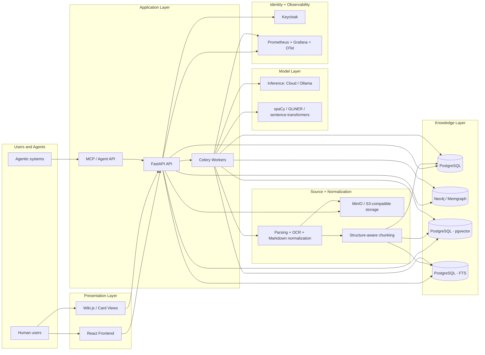
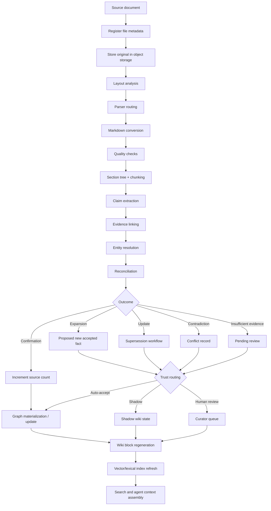
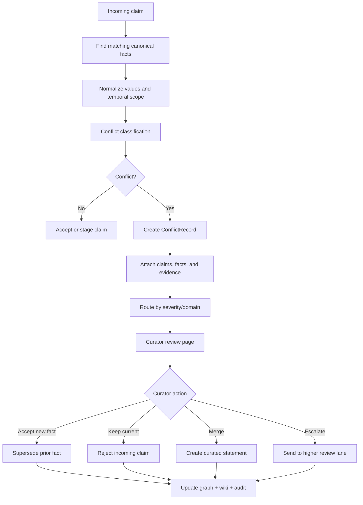
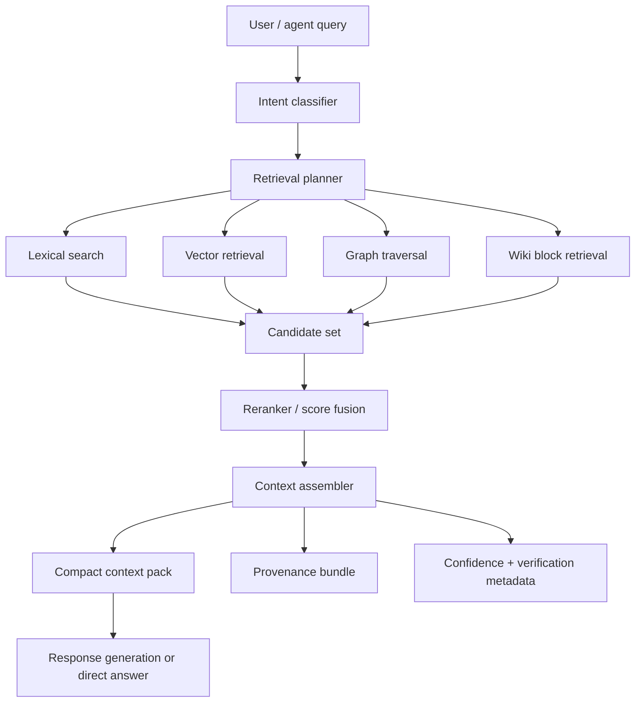
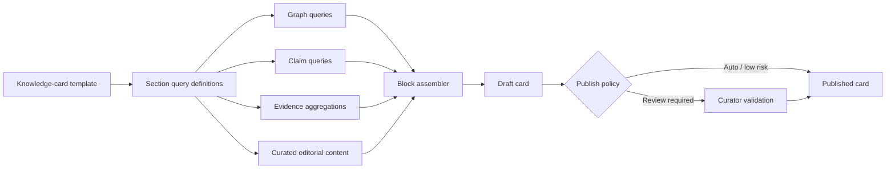

# Architecture Diagram 

## 1. System landscape diagram

---

## 2. Document-to-knowledge pipeline

---

## 3. Context assembly

---

## 4. Hybrid retrieval 

---

## 5. Knowledge-card generation flow

