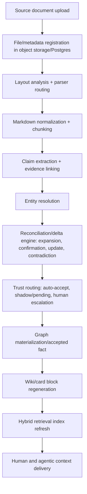

# Metamorph Knowledge Pipeline & Ontology

## 1. Overview

This document describes the evidence-backed, layered knowledge pipeline from document ingestion to agentic context. Each stage enforces auditability, explainability, and governance.

### Pipeline Layers
- **0:** Source of Record – Immutable file/artifact store
- **1:** Normalization – Markdown/structured document, chunked, quality/audit trails
- **2:** Claims & Evidence – Atomic claims with provenance, qualifiers, temporal, confidence, and evidence spans
- **3:** Reconciled Knowledge – Accepted, superseded, or conflicted facts, trust-routing
- **4:** Knowledge Graph – Canonical entities, typed relations, contradictions, curator decisions
- **5:** Wiki/Cards – Human-curated pages assembled from graph, claims, evidence
- **6:** Hybrid Retrieval & Agent Context – Search, block retrieval, agent context packs

---

## 2. Key Principles
- **Claim > Triplet:** Each claim includes provenance, span, temporal, confidence, qualifiers, status, review.
- **Provenance is mandatory:** Everything is traceable to exact section, page, chunk, timestamp, extraction/version.
- **Wiki is curated, not canonical:** Wiki/cards synthesize; DB/graph/claims remain the backend of truth.
- **Hybrid retrieval:** Vector, lexical, graph, and curated wiki blocks all contribute to retrieval/answer.
- **Curation happens in context:** Validation, trust, verification, conflict, and escalations are embedded in wiki/card surface and reviewer workflows (with agent parity).
- **All knowledge state transitions (proposed/accepted/shadow/expired/conflicted) are explicit and surfaced.**

---

## 3. End-to-End Pipeline Flow



---

## 4. Claim/Evidence Model (JSON example)
```json
{
  "claim_id": "uuid",
  "claim_type": "relation|attribute|event|classification|summary_statement",
  "subject": { "label": "NodeType", "id": "string|null", "name": "string" },
  "predicate": "EDGE_TYPE_OR_ATTRIBUTE",
  "object": { "label": "NodeType", "id": "string|null", "name": "string|null" },
  "qualifiers": {"amount": 1300000, "currency": "USD", "country": "Ukraine"},
  "temporal": { "observed_at": null, "valid_from": null, "valid_to": null },
  "provenance": { "source_document_id": "string", "section_path": ["Heading 1"], "span_start": 123, "span_end": 188, "raw_text_snippet": "...." },
  "confidence": { "claim_confidence": 0.99, "entity_resolution_confidence": 0.92 },
  "status": "PROPOSED"
}
```

---

## 5. Pipeline QA, Rounds/Progressive Graph Building

Knowledge graph build proceeds in incremental “rounds”—each round bootstraps layers of masterdata/context/evidence:
- **Round 1:** Masterdata – countries, regions, orgs, contexts, policies, population/anchor
- **Round 2:** Ops context – situations, partners, activities
- **Round 3:** Evidence – evaluations, contracts, claims, findings

Scripts: `build_graph_round.py` implements this progressive loading. See [docs/ontology/README.md](../ontology/README.md) for details and policies.

All nodes/facts are deduplicated by canonical ID/IRI/external id, with merge/split and history tracked.

---

## 6. Agent, API, and Retrieval Requirements
- All blocks, facts, claims, and entities must expose provenance inline or on modal/click.
- Contradiction and pending badges are programmatic; a block/fact is only rendered as accepted when its trust state is eligible by blueprint rules.
- Agent retrieval must return evidence-cited, truncation-marked, freshness-scored context packs (never just blobbed PDF text or raw embeddings).
- Community-trust and human verification state must be surfaced in both UI and agent response contract.

---

## 7. Success Criteria
- All accepted knowledge is evidence-backed and traceable.
- Contradictions/updates never overwrite without review.
- Hybrid retrieval returns cited, context-rich, verification-marked answers (UI or agent).
- Curators/reviewers can perform all tasks in-context, without needing to read raw PDF/markup as primary workflow.

---

For DB schema, see [DATABASE.md](./DATABASE.md). For curation/review, see [CURATION.md](./CURATION.md).