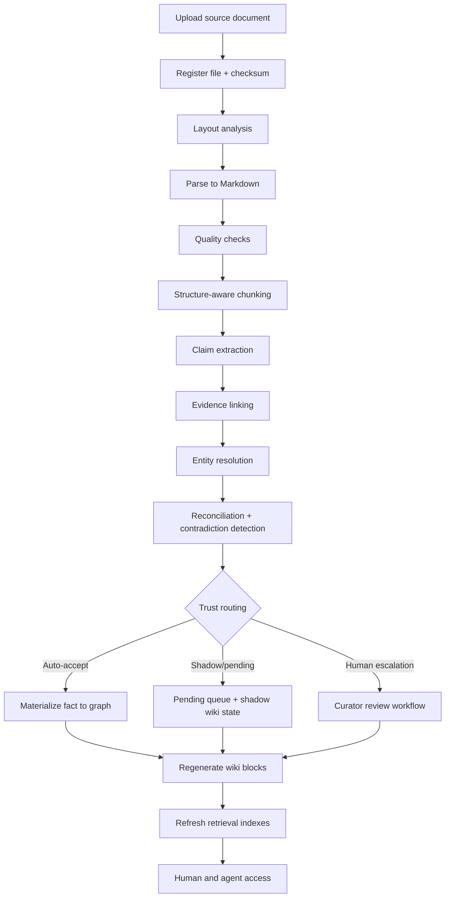

# Metamorph — Architecture Overview

## 1. What Metamorph is

Metamorph is an open-source, cloud-agnostic **knowledge operating system** for turning document collections into an auditable, curated, graph-backed, wiki-centric knowledge base.

It is designed for domains where the user needs more than semantic recall:

- provenance
- curation
- contradiction resolution
- temporal validity
- stable entities and relationships
- agent-ready context with citations

Instead of treating PDFs as a vector-store-first corpus, Metamorph uses a layered pipeline:

```text
Source documents
  → normalization to structured Markdown
  → atomic claims + evidence spans
  → ontology-guided knowledge graph
  → wiki pages / knowledge cards
  → hybrid retrieval + context assembly
  → human and agent workflows
```

---

## 2. Design goals

### Primary goals
- Preserve provenance from ingestion to answer generation
- Enable entity-centric curation in a wiki experience
- Support multi-hop reasoning through a knowledge graph
- Keep retrieval hybrid rather than graph-only or vector-only
- Remain fully deployable with open-source software on any infrastructure

### Non-goals
- Building a raw PDF dump with only embeddings
- Treating wiki pages as the canonical database
- Replacing human review in all high-impact domains
- Hard-coding dependence on any proprietary model provider or cloud service

---

## 3. Core layers

### Layer 0 — Source of record
Stores immutable original files and metadata.

**Key outputs**
- file version
- checksum
- storage path
- MIME type
- document lineage

### Layer 1 — Document normalization
Converts source files to normalized Markdown and structure-aware extraction artifacts.

**Key outputs**
- Markdown
- section tree
- chunks
- page references
- table artifacts
- OCR metadata
- quality report

### Layer 2 — Evidence and claims
Extracts atomic claims anchored to evidence spans.

**Key outputs**
- claim records
- evidence spans
- qualifiers
- temporal scope
- extractor metadata
- confidence scores

### Layer 3 — Knowledge graph
Materializes canonicalized, reconciled knowledge in a graph database.

**Key outputs**
- canonical entities
- typed relations
- accepted facts
- aliases
- contradiction links
- curator decisions

### Layer 4 — Wiki / knowledge cards
Builds human-friendly entity and topic views over the accepted knowledge.

**Key outputs**
- entity pages
- topic pages
- timelines
- knowledge cards
- contradiction banners
- freshness markers

### Layer 5 — Retrieval and context assembly
Provides hybrid retrieval and task-oriented context building for both humans and agents.

**Key outputs**
- lexical hits
- vector hits
- graph neighborhoods
- wiki block retrieval
- compact context packs with provenance

---

## 4. High-level workflow



---

## 5. Why claims matter more than raw triplets

A plain RDF-style or property-graph triplet is too small to support safe operations in high-trust domains.

Metamorph treats a claim as richer than a triplet because it includes:
- provenance
- exact evidence span
- extraction metadata
- confidence
- temporal validity
- review status
- qualifiers (amount, unit, geography, legal scope, etc.)

This enables:
- contradiction resolution
- auditability
- better curation
- better graph materialization
- higher quality agent context

---

## 6. Why the wiki is the primary curation interface

Curators generally reason better over **entity- and topic-centric pages** than over ingestion queues or raw PDFs.

The wiki page is where the system turns extracted facts into operational knowledge.

Every wiki block should support:
- provenance drill-down
- evidence view
- verification / review badges
- freshness indicators
- contradiction banners where relevant
- edit or merge actions

The wiki is therefore:
- a **presentation layer**
- a **curation surface**
- a **human trust interface**

But it is **not** the canonical storage layer.

---

## 7. Why retrieval remains hybrid

Graph retrieval is powerful for:
- entity-centric queries
- traversals
- multi-hop reasoning
- cross-document synthesis

Vector retrieval is still valuable for:
- fuzzy recall
- long-tail phrasing
- weakly structured content
- finding evidence that the graph missed

Lexical retrieval remains critical for:
- codes, identifiers, acronyms
- exact phrases
- policy and legal citations

Metamorph therefore supports all three and fuses them at query time.

---

## 8. Contradiction handling philosophy

The system should never silently overwrite accepted facts.

Incoming claims can be classified as:
- confirmation
- expansion
- update / supersession
- contradiction
- duplicate
- insufficient evidence

Contradiction detection is not a single classifier. It requires:
- entity resolution quality
- unit/value normalization
- temporal scoping
- source weighting
- ontology-aware rules
- human review for high-impact cases

---

## 9. Open-source, cloud-agnostic stack

### Default stack
- FastAPI
- PostgreSQL
- Redis
- Neo4j Community or Memgraph
- MinIO
- Qdrant or pgvector
- OpenSearch or PostgreSQL FTS
- Wiki.js
- Keycloak
- Prometheus + Grafana + OpenTelemetry
- Ollama and/or vLLM for self-hosted model serving

### Why this stack
It is:
- portable
- mature
- open-source
- friendly to local, on-prem, and cloud deployments
- modular enough to swap infrastructure components via adapters

---

## 10. Deployment topology

### Minimum viable deployment
- API
- worker
- frontend
- PostgreSQL
- Redis
- Neo4j
- MinIO
- Qdrant or pgvector
- Ollama or other local model server

### Full production deployment
Add:
- OpenSearch
- Wiki.js
- Keycloak
- Prometheus / Grafana / OTel collector
- separate staging/production environments
- object storage lifecycle policy
- backup strategy for graph and relational data

---

## 11. Security and governance

### Required controls
- RBAC / OIDC
- audit logs for every curation decision
- row- or tenant-level isolation where needed
- document access propagation into retrieval
- optional restricted-content tagging and redaction
- signed provenance and change history where governance requires it

---

## 12. Suggested repo layout

```text
backend/
frontend/
infrastructure/
docs/
scripts/
AGENT.md
README.architecture.md
DATABASE_BLUEPRINT.md
IMPLEMENTATION_BACKLOG.md
ARCHITECTURE_DIAGRAM.md
```

---

## 13. Recommended MVP cut

### MVP scope
- PDF/DOCX ingestion
- Markdown normalization
- chunking
- claim extraction
- basic evidence linking
- entity resolution for 2–3 core entity types
- contradiction queue
- wiki pages for key entities
- hybrid retrieval over claims + wiki sections + chunks
- agent context assembly endpoint

### Do not try in v1
- perfect ontology coverage
- full auto-resolution of contradictions
- broad multimodal extraction
- advanced community summarization on day one
- very large-scale GPU optimization before the workflow is proven

---

## 14. Operating principle

> The system is successful when humans trust the curated knowledge layer, agents can consume concise evidence-backed context, and every accepted statement can be traced back to its source.
