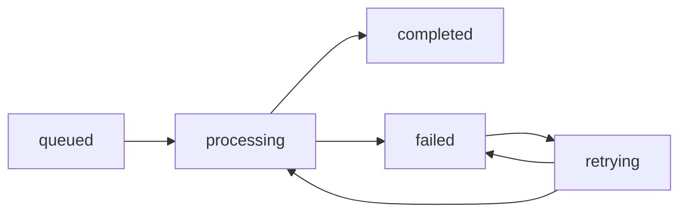
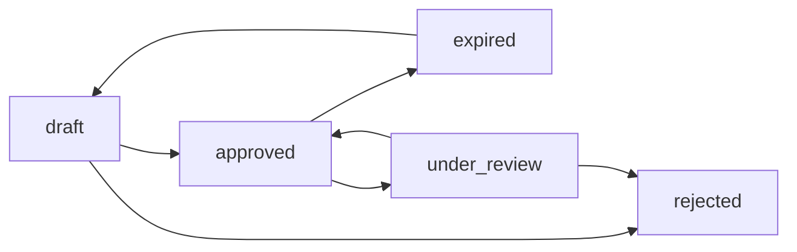
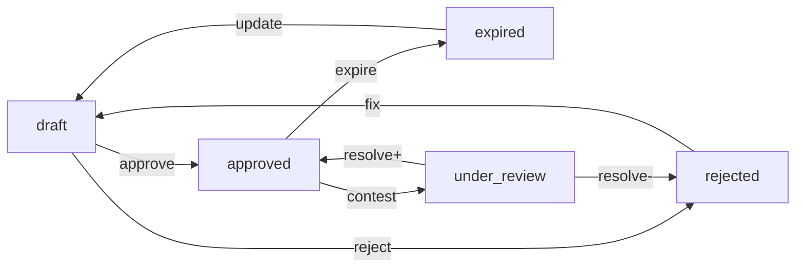
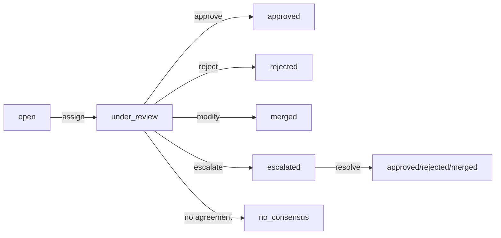
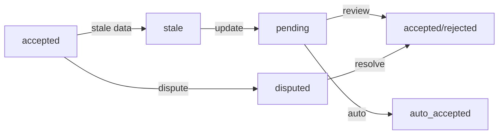

# Data Model: Metamorph Website-to-Knowledge System

**Date**: 2026-05-12 | **Spec**: [spec.md](./spec.md) | **Plan**: [plan.md](./plan.md) | **Research**: [research.md](./research.md)

This document defines the comprehensive data model for Metamorph v3.0, including entities, relationships, validation rules, and state transitions.

---

## 1. Core Entities

### 1.1 Website

**Description**: Represents a website that has been defined for scraping and knowledge extraction.

**Fields**:
```typescript
interface Website {
  id: string; // UUID
  url: string; // Root URL provided by user
  domain: string; // Extracted domain
  title?: string; // Website title if available
  description?: string; // Website description if available
  discovered_at: DateTime; // When first discovered
  last_scraped_at?: DateTime; // Last successful scrape
  scrape_frequency: 'manual' | 'daily' | 'weekly' | 'monthly'; // Scraping schedule
  status: 'active' | 'paused' | 'error'; // Current status
  robots_txt_url?: string; // URL to robots.txt
  sitemap_url?: string; // URL to sitemap.xml
  total_files_discovered: number; // Count of discovered files
  total_files_ingested: number; // Count of ingested files
  last_successful_scrape?: DateTime; // Last successful scrape completion
  error_message?: string; // Error details if status is 'error'
}
```

**Validation Rules**:
- `url`: Must be valid URL format
- `domain`: Must be valid domain name
- `scrape_frequency`: Must be one of allowed values
- `status`: Must be one of allowed values

**Relationships**:
- `HAS_DISCOVERED_FILES` → DiscoveredFile[]
- `HAS_SCRAPE_SESSIONS` → ScrapeSession[]

---

### 1.2 DiscoveredFile

**Description**: Represents a file discovered during website crawling that is available for selection and ingestion.

**Fields**:
```typescript
interface DiscoveredFile {
  id: string; // UUID
  website_id: string; // Reference to Website
  url: string; // Full URL to the file
  file_type: 'pdf' | 'docx' | 'xlsx' | 'pptx' | 'html' | 'txt' | 'other';
  file_name: string; // Extracted filename
  file_size?: number; // Size in bytes
  last_modified_date?: DateTime; // Last modified date from headers
  content_hash?: string; // SHA-256 hash for change detection
  discovered_at: DateTime; // When discovered
  status: 'pending' | 'selected' | 'processing' | 'ingested' | 'error' | 'skipped';
  error_message?: string; // Error details if status is 'error'
  metadata?: Record<string, any>; // Extracted metadata (author, title, etc.)
  preview_text?: string; // First 500 characters for preview
  selected_at?: DateTime; // When user selected for ingestion
  processed_at?: DateTime; // When processing completed
}
```

**Validation Rules**:
- `url`: Must be valid URL
- `file_type`: Must be one of allowed values
- `status`: Must be one of allowed values
- `website_id`: Must reference existing Website

**Relationships**:
- `DISCOVERED_FROM` → Website
- `HAS_INGESTION_JOBS` → IngestionJob[]
- `INGESTED_AS` → Document?

---

### 1.3 ScrapeSession

**Description**: Represents a single execution of the website crawler, tracking all discovered and processed files.

**Fields**:
```typescript
interface ScrapeSession {
  id: string; // UUID
  website_id: string; // Reference to Website
  started_at: DateTime; // When scraping started
  completed_at?: DateTime; // When scraping completed
  status: 'running' | 'completed' | 'failed' | 'cancelled';
  files_discovered: number; // Total files discovered
  files_selected: number; // Files selected by user
  files_ingested: number; // Files successfully ingested
  files_failed: number; // Files that failed ingestion
  error_summary?: string; // Summary of errors
  crawl_duration_seconds?: number; // Duration in seconds
  user_id?: string; // User who initiated the scrape
  schedule_type?: 'manual' | 'scheduled'; // How it was triggered
}
```

**Validation Rules**:
- `website_id`: Must reference existing Website
- `status`: Must be one of allowed values
- `started_at`: Must be valid datetime
- `completed_at`: Must be after started_at if present

**Relationships**:
- `BELONGS_TO` → Website
- `DISCOVERED_FILES` → DiscoveredFile[]
- `HAS_INGESTION_JOBS` → IngestionJob[]

---

### 1.4 IngestionJob

**Description**: Represents the processing job for a single discovered file.

**Fields**:
```typescript
interface IngestionJob {
  id: string; // UUID
  discovered_file_id: string; // Reference to DiscoveredFile
  scrape_session_id: string; // Reference to ScrapeSession
  status: 'queued' | 'processing' | 'completed' | 'failed' | 'retrying';
  started_at?: DateTime; // When processing started
  completed_at?: DateTime; // When processing completed
  error_message?: string; // Error details if failed
  retry_count: number; // Number of retry attempts
  document_id?: string; // Reference to resulting Document
  parser_used?: 'docling' | 'mineru' | 'manual'; // Which parser was used
  parse_success?: boolean; // Whether parsing succeeded
  parse_error?: string; // Parsing error details
  extraction_metadata?: Record<string, any>; // Metadata from extraction
}
```

**Validation Rules**:
- `discovered_file_id`: Must reference existing DiscoveredFile
- `scrape_session_id`: Must reference existing ScrapeSession
- `status`: Must be one of allowed values
- `retry_count`: Must be >= 0

**Relationships**:
- `PROCESSES` → DiscoveredFile
- `BELONGS_TO` → ScrapeSession
- `CREATES` → Document?

**State Transitions**:


---

### 1.5 Document

**Description**: Represents a successfully parsed and ingested document in the knowledge graph.

**Fields**:
```typescript
interface Document {
  id: string; // UUID
  ingestion_job_id: string; // Reference to IngestionJob
  discovered_file_id: string; // Reference to DiscoveredFile
  website_id: string; // Reference to Website
  original_url: string; // Original file URL
  file_type: 'pdf' | 'docx' | 'xlsx' | 'pptx' | 'html' | 'txt' | 'other';
  file_name: string; // Original filename
  file_size?: number; // Size in bytes
  download_date: DateTime; // When file was downloaded
  parse_date: DateTime; // When parsing completed
  parsing_tool?: 'docling' | 'mineru' | 'manual'; // Tool used for parsing
  parse_success: boolean; // Whether parsing succeeded
  parse_error?: string; // Parsing error if any
  content_hash: string; // SHA-256 hash of content
  extracted_text?: string; // Full extracted text
  metadata?: Record<string, any>; // Document metadata
  language?: string; // Detected language
  word_count?: number; // Word count
  page_count?: number; // Page count for PDFs
  author?: string; // Author if available
  title?: string; // Document title
  creation_date?: DateTime; // Original creation date
  modification_date?: DateTime; // Original modification date
}
```

**Validation Rules**:
- `ingestion_job_id`: Must reference existing IngestionJob
- `discovered_file_id`: Must reference existing DiscoveredFile
- `website_id`: Must reference existing Website
- `file_type`: Must be one of allowed values
- `parse_success`: Must be boolean

**Relationships**:
- `CREATED_BY` → IngestionJob
- `FROM_DISCOVERED_FILE` → DiscoveredFile
- `FROM_WEBSITE` → Website
- `CONTAINS_ENTITIES` → Entity[]
- `MENTIONS_EVENTS` → Event[]
- `HAS_SEMANTIC_TRIPLETS` → SemanticTriplet[]

---

## 2. Knowledge Graph Entities

### 2.1 Entity

**Description**: Represents a real-world entity (person, organization, location, etc.) extracted from documents.

**Fields**:
```typescript
interface Entity {
  id: string; // UUID
  entity_type: 'person' | 'organization' | 'location' | 'event' | 'concept' | 'other';
  name: string; // Entity name
  description?: string; // Entity description
  aliases?: string[]; // Alternative names
  entity_subtype?: string; // More specific classification
  confidence_score?: number; // 0-1 confidence in extraction
  source_documents?: string[]; // References to source Document IDs
  first_seen?: DateTime; // When first encountered
  last_seen?: DateTime; // When last encountered
  canonical_url?: string; // Canonical reference URL
  wikidata_id?: string; // Wikidata identifier if available
  geo_coordinates?: { lat: number; lng: number }; // For locations
}
```

**Validation Rules**:
- `entity_type`: Must be one of allowed values
- `name`: Required and non-empty
- `confidence_score`: Must be between 0 and 1 if present

**Relationships**:
- `EXTRACTED_FROM` → Document[]
- `RELATED_TO` → Entity[]
- `PARTICIPATES_IN` → Event[]
- `LOCATED_AT` → Location[]

---

### 2.2 Event

**Description**: Represents a temporal event extracted from documents.

**Fields**:
```typescript
interface Event {
  id: string; // UUID
  event_type: 'meeting' | 'conference' | 'disaster' | 'policy_change' | 'other';
  title?: string; // Event title
  description?: string; // Event description
  start_date?: DateTime; // Event start date/time
  end_date?: DateTime; // Event end date/time
  location?: string; // Event location
  organizers?: string[]; // Organizing entities
  participants?: string[]; // Participating entities
  source_documents?: string[]; // References to source Document IDs
  confidence_score?: number; // 0-1 confidence in extraction
  is_recurring?: boolean; // Whether event is recurring
  recurrence_pattern?: string; // Recurrence pattern if applicable
}
```

**Validation Rules**:
- `event_type`: Must be one of allowed values
- `end_date`: Must be after start_date if both present
- `confidence_score`: Must be between 0 and 1 if present

**Relationships**:
- `EXTRACTED_FROM` → Document[]
- `INVOLVES` → Entity[]
- `OCCURS_AT` → Location[]

---

### 2.3 SemanticTriplet

**Description**: Represents a structured knowledge triplet (Subject → Predicate → Object).

**Fields**:
```typescript
interface SemanticTriplet {
  id: string; // UUID
  subject_id: string; // Reference to subject Entity or literal
  subject_type: 'entity' | 'literal';
  predicate: string; // Relationship type
  object_id: string; // Reference to object Entity or literal
  object_type: 'entity' | 'literal';
  document_id: string; // Reference to source Document
  confidence_score?: number; // 0-1 confidence in extraction
  extraction_method?: 'automatic' | 'manual' | 'curated';
  extracted_at: DateTime; // When extracted
  extracted_by?: string; // User/process that extracted
  is_validated?: boolean; // Whether manually validated
  validated_by?: string; // User who validated
  validated_at?: DateTime; // When validated
  provenance?: Provenance; // Detailed provenance information
}
```

**Validation Rules**:
- `subject_id`: Must reference existing Entity or be valid literal
- `object_id`: Must reference existing Entity or be valid literal
- `document_id`: Must reference existing Document
- `confidence_score`: Must be between 0 and 1 if present

**Relationships**:
- `SUBJECT` → Entity/Literal
- `OBJECT` → Entity/Literal
- `EXTRACTED_FROM` → Document

---

### 2.4 Provenance

**Description**: Detailed provenance information for traceability.

**Fields**:
```typescript
interface Provenance {
  source_website_id: string; // Reference to Website
  source_website_url: string; // Website URL
  source_file_id?: string; // Reference to DiscoveredFile
  source_file_url?: string; // File URL
  source_document_id: string; // Reference to Document
  extraction_date: DateTime; // When extracted
  extraction_tool?: string; // Tool used for extraction
  curator_id?: string; // User who curated
  curation_date?: DateTime; // When curated
  validation_state?: 'auto_accepted' | 'pending' | 'accepted' | 'rejected' | 'disputed';
  validation_date?: DateTime; // When validation state was set
  validator_id?: string; // User who set validation state
}
```

**Validation Rules**:
- `source_website_id`: Must reference existing Website
- `source_document_id`: Must reference existing Document
- `validation_state`: Must be one of allowed values if present

---

## 3. Knowledge Cards

### 3.1 KnowledgeCard

**Description**: Represents one of the six knowledge card types used in proposal drafting.

**Fields**:
```typescript
interface KnowledgeCard {
  id: string; // UUID
  card_type: 'KC-1' | 'KC-2' | 'KC-3' | 'KC-4' | 'KC-5' | 'KC-6';
  title: string; // Card title
  description?: string; // Card description
  domain: 'geographic' | 'crisis' | 'demographics' | 'programming' | 'policy' | 'finance' | 'hr' | 'knowledge_assets';
  status: 'draft' | 'approved' | 'expired' | 'rejected' | 'under_review';
  validity_period: { start: DateTime; end: DateTime }; // Validity window
  created_at: DateTime; // When created
  created_by: string; // User who created
  updated_at?: DateTime; // When last updated
  updated_by?: string; // User who last updated
  approved_at?: DateTime; // When approved
  approved_by?: string; // User who approved
  expiry_reason?: string; // Reason for expiry if applicable
  source_entities?: string[]; // References to source Entity IDs
  source_events?: string[]; // References to source Event IDs
  source_documents?: string[]; // References to source Document IDs
}
```

**Card Types**:
- `KC-1`: Donor Intelligence
- `KC-2`: Field Context  
- `KC-3`: Outcome Evidence
- `KC-4`: Partner Capacity
- `KC-5`: Institutional Track Record
- `KC-6`: Crisis Political Economy

**Validation Rules**:
- `card_type`: Must be one of allowed values
- `domain`: Must be one of allowed values
- `status`: Must be one of allowed values
- `validity_period.end`: Must be after validity_period.start

**Relationships**:
- `HAS_BLOCKS` → WikiBlock[]
- `BASED_ON_ENTITIES` → Entity[]
- `REFERENCES_EVENTS` → Event[]
- `SOURCED_FROM_DOCUMENTS` → Document[]

**State Transitions**:


---

### 3.2 WikiBlock

**Description**: Represents a content block within a knowledge card.

**Fields**:
```typescript
interface WikiBlock {
  id: string; // UUID
  card_id: string; // Reference to KnowledgeCard
  section_name: string; // Section within the card
  content: string; // Block content (markdown)
  word_limit: number; // Maximum words allowed
  block_type: 'text' | 'table' | 'list' | 'metric' | 'reference';
  template_query?: string; // Query template for extraction
  verification_state: 'accepted' | 'auto_accepted' | 'pending' | 'disputed' | 'under_review' | 'rejected' | 'merged' | 'escalated' | 'stale' | 'superseded' | 'no_consensus';
  provenance?: Provenance; // Detailed provenance
  created_at: DateTime; // When created
  created_by: string; // User who created
  updated_at?: DateTime; // When last updated
  updated_by?: string; // User who last updated
  maintenance_tags?: string[]; // Tags like 'citation_needed', 'stale', etc.
  discussion_thread_id?: string; // Reference to DiscussionThread
}
```

**Validation Rules**:
- `card_id`: Must reference existing KnowledgeCard
- `verification_state`: Must be one of allowed values
- `word_limit`: Must be positive integer
- `block_type`: Must be one of allowed values

**Relationships**:
- `BELONGS_TO` → KnowledgeCard
- `HAS_PROVENANCE` → Provenance
- `LINKED_TO_DISCUSSION` → DiscussionThread?

---

## 4. Curation & Review Entities

### 4.1 DiscussionThread

**Description**: Represents a discussion thread for contested knowledge.

**Fields**:
```typescript
interface DiscussionThread {
  id: string; // UUID
  title: string; // Thread title
  topic: string; // Topic being discussed
  status: 'open' | 'under_review' | 'consensus_reached' | 'no_consensus' | 'rejected' | 'escalated' | 'resolved' | 'archived';
  created_at: DateTime; // When created
  created_by: string; // User who created
  updated_at?: DateTime; // When last updated
  resolved_at?: DateTime; // When resolved
  resolved_by?: string; // User who resolved
  consensus_result?: 'accept' | 'reject' | 'merge' | 'escalate' | 'defer';
  linked_entity_id?: string; // Reference to related Entity
  linked_block_id?: string; // Reference to related WikiBlock
  linked_card_id?: string; // Reference to related KnowledgeCard
  watchers?: string[]; // Users watching this thread
}
```

**Validation Rules**:
- `status`: Must be one of allowed values
- `consensus_result`: Must be one of allowed values if present

---

### 4.2 DiscussionComment

**Description**: Represents a comment within a discussion thread.

**Fields**:
```typescript
interface DiscussionComment {
  id: string; // UUID
  thread_id: string; // Reference to DiscussionThread
  content: string; // Comment content (markdown)
  created_at: DateTime; // When created
  created_by: string; // User who created
  updated_at?: DateTime; // When last updated
  updated_by?: string; // User who last updated
  is_edited: boolean; // Whether comment was edited
  mentions?: string[]; // Mentioned users
  attachments?: string[]; // Attached files/documents
  evidence_quality?: 'low' | 'medium' | 'high'; // Quality of evidence provided
  policy_compliance?: boolean; // Whether compliant with policies
}
```

**Validation Rules**:
- `thread_id`: Must reference existing DiscussionThread

---

### 4.3 ValidationCard

**Description**: Represents a validation card for reviewing contested knowledge.

**Fields**:
```typescript
interface ValidationCard {
  id: string; // UUID
  target_type: 'entity' | 'block' | 'card' | 'triplet';
  target_id: string; // Reference to target object
  current_value?: any; // Current accepted value
  proposed_value?: any; // Proposed new value
  diff?: string; // Diff between current and proposed
  evidence?: string[]; // Supporting evidence
  provenance?: Provenance; // Provenance information
  confidence_score?: number; // 0-1 confidence score
  sensitivity?: 'low' | 'medium' | 'high'; // Sensitivity level
  source_reliability?: 'trusted' | 'uncertain' | 'unreliable';
  contradiction_type?: 'factual' | 'temporal' | 'interpretation' | 'classification';
  created_at: DateTime; // When created
  created_by?: string; // User/system that created
  assigned_to?: string; // Assigned reviewer
  assigned_tier?: 'tier_1' | 'tier_2' | 'tier_3'; // Review tier
  status: 'open' | 'under_review' | 'approved' | 'rejected' | 'merged' | 'escalated' | 'no_consensus';
  resolution?: string; // Resolution details
  resolved_at?: DateTime; // When resolved
  resolved_by?: string; // User who resolved
}
```

**Validation Rules**:
- `target_type`: Must be one of allowed values
- `sensitivity`: Must be one of allowed values if present
- `assigned_tier`: Must be one of allowed values if present
- `status`: Must be one of allowed values

---

## 5. Audit & Revision Entities

### 5.1 AuditEvent

**Description**: Represents an audit event for tracking changes.

**Fields**:
```typescript
interface AuditEvent {
  id: string; // UUID
  event_type: 'create' | 'update' | 'delete' | 'approve' | 'reject' | 'escalate' | 'revert';
  entity_type: string; // Type of entity changed
  entity_id: string; // ID of entity changed
  performed_by: string; // User who performed action
  performed_at: DateTime; // When performed
  old_value?: any; // Previous value (for updates)
  new_value?: any; // New value (for updates/deletes)
  reason?: string; // Reason for change
  ip_address?: string; // IP address of performer
  user_agent?: string; // User agent
  session_id?: string; // Session ID
}
```

**Validation Rules**:
- `event_type`: Must be one of allowed values
- `entity_type`: Must be non-empty
- `entity_id`: Must be non-empty

---

### 5.2 Revision

**Description**: Represents a revision of an entity.

**Fields**:
```typescript
interface Revision {
  id: string; // UUID
  entity_type: string; // Type of entity revised
  entity_id: string; // ID of entity revised
  revision_number: number; // Sequential revision number
  content: any; // Full content at this revision
  created_at: DateTime; // When created
  created_by: string; // User who created
  is_accepted: boolean; // Whether this is an accepted revision
  accepted_at?: DateTime; // When accepted
  accepted_by?: string; // User who accepted
  superseded_by?: string; // ID of revision that supersedes this one
}
```

**Validation Rules**:
- `entity_type`: Must be non-empty
- `entity_id`: Must be non-empty
- `revision_number`: Must be positive integer

---

## 6. State Machines & Workflows

### 6.1 Knowledge Card Lifecycle



### 6.2 Validation Card Workflow



### 6.3 Wiki Block Verification States



---

## 7. Indexes & Performance Considerations

### 7.1 Recommended Indexes

**For Fast Retrieval**:
- `Website.url` (unique)
- `DiscoveredFile.url` (unique)
- `Document.content_hash` (unique)
- `Entity.name` (text search)
- `KnowledgeCard.card_type` + `KnowledgeCard.domain`
- `WikiBlock.verification_state`
- `ValidationCard.status` + `ValidationCard.assigned_tier`

**For Relationship Traversal**:
- `DiscoveredFile.website_id`
- `IngestionJob.discovered_file_id`
- `Document.website_id`
- `SemanticTriplet.document_id`
- `WikiBlock.card_id`

### 7.2 Query Optimization Strategies

**Crawling & Discovery**:
- Batch operations for file discovery
- Pagination for large result sets
- Caching of website metadata

**Knowledge Retrieval**:
- Full-text search on document content
- Graph traversal optimization
- Materialized views for common queries

**Curation Workflows**:
- Pre-computed validation queues
- Cached discussion thread counts
- Optimized audit log queries

---

## 8. Data Validation & Integrity

### 8.1 Cross-Entity Constraints

**Referential Integrity**:
- All foreign key references must point to existing entities
- Cascade delete for dependent entities where appropriate
- Soft delete pattern for entities with historical significance

**Temporal Consistency**:
- `end_date` must be after `start_date` for temporal entities
- `updated_at` must be after `created_at`
- Validity periods must not overlap for the same entity type

**State Consistency**:
- Only one accepted revision per entity at a time
- Validation cards must reference existing targets
- Discussion threads must have valid status transitions

### 8.2 Data Quality Rules

**Mandatory Fields**:
- All `id` fields must be unique UUIDs
- All temporal fields must be valid ISO 8601 datetimes
- All URL fields must be valid URLs

**Business Rules**:
- Knowledge cards cannot be approved without valid provenance
- Wiki blocks cannot be accepted without content
- Validation cards must have either current_value or proposed_value

---

## 9. API Contracts & Data Transfer Objects

### 9.1 Common DTO Structure

```typescript
interface BaseDTO {
  id: string;
  created_at: string; // ISO 8601
  updated_at?: string; // ISO 8601
  created_by: string;
  updated_by?: string;
}

interface PaginatedResponse<T> {
  data: T[];
  total: number;
  page: number;
  page_size: number;
  has_more: boolean;
}
```

### 9.2 Key API Endpoints & DTOs

**Website Scraping**:
```typescript
// POST /api/v1/websites
interface CreateWebsiteDTO {
  url: string;
  scrape_frequency?: 'manual' | 'daily' | 'weekly' | 'monthly';
  title?: string;
  description?: string;
}

// GET /api/v1/websites/{id}/files
interface DiscoveredFileDTO extends BaseDTO {
  website_id: string;
  url: string;
  file_type: string;
  file_name: string;
  file_size?: number;
  last_modified_date?: string;
  status: string;
  preview_text?: string;
}
```

**File Selection & Ingestion**:
```typescript
// POST /api/v1/websites/{id}/files/select
interface SelectFilesDTO {
  file_ids: string[];
}

// POST /api/v1/websites/{id}/ingest
interface StartIngestionDTO {
  notify_email?: string;
  priority?: 'low' | 'normal' | 'high';
}

// GET /api/v1/ingestion/jobs/{id}
interface IngestionJobDTO extends BaseDTO {
  discovered_file_id: string;
  status: string;
  error_message?: string;
  retry_count: number;
  document_id?: string;
}
```

**Knowledge Cards**:
```typescript
// GET /api/v1/cards
interface KnowledgeCardDTO extends BaseDTO {
  card_type: string;
  title: string;
  domain: string;
  status: string;
  validity_period: { start: string; end: string };
  source_entities?: string[];
  source_documents?: string[];
}

// GET /api/v1/cards/{id}/blocks
interface WikiBlockDTO extends BaseDTO {
  section_name: string;
  content: string;
  word_limit: number;
  block_type: string;
  verification_state: string;
  provenance?: ProvenanceDTO;
}
```

---

## 10. Implementation Notes

### 10.1 Database Schema Evolution

**Migration Strategy**:
- Use Alembic for SQL schema migrations
- Implement backward-compatible changes where possible
- Versioned API endpoints for breaking changes
- Data transformation scripts for major schema changes

### 10.2 Performance Considerations

**Neo4j Optimization**:
- Use appropriate indexes for frequent query patterns
- Batch graph operations where possible
- Implement query timeouts to prevent runaway queries
- Monitor and optimize Cypher queries

**Scalability**:
- Horizontal scaling for crawling workers
- Connection pooling for database access
- Caching layer for frequently accessed data
- Asynchronous processing for long-running operations

### 10.3 Data Privacy & Security

**Sensitive Data Handling**:
- Encryption of PII at rest and in transit
- Access controls based on user roles
- Audit logging for sensitive operations
- Data retention policies and automated purging

**Compliance**:
- GDPR compliance for European data
- UN data protection policies
- Regular security audits and penetration testing

---

## Summary

This data model provides a comprehensive foundation for the Metamorph Website-to-Knowledge System, covering:

✅ **Core Entities**: Website, DiscoveredFile, ScrapeSession, IngestionJob, Document
✅ **Knowledge Graph**: Entity, Event, SemanticTriplet, Provenance
✅ **Knowledge Cards**: KnowledgeCard, WikiBlock with full lifecycle management
✅ **Curation Workflows**: DiscussionThread, DiscussionComment, ValidationCard
✅ **Audit & Revision**: AuditEvent, Revision with complete history tracking
✅ **State Machines**: Comprehensive workflow definitions
✅ **API Contracts**: Well-defined DTOs and endpoint structures
✅ **Performance**: Indexing strategies and optimization approaches
✅ **Security**: Data protection and compliance considerations

The model supports all functional requirements from the specification while maintaining flexibility for future evolution. All entities include proper validation rules, relationships, and state management to ensure data integrity throughout the system lifecycle.